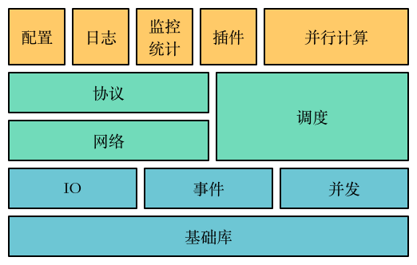
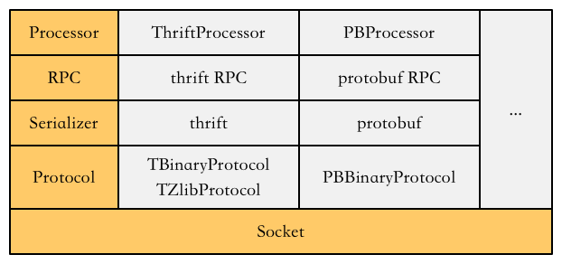
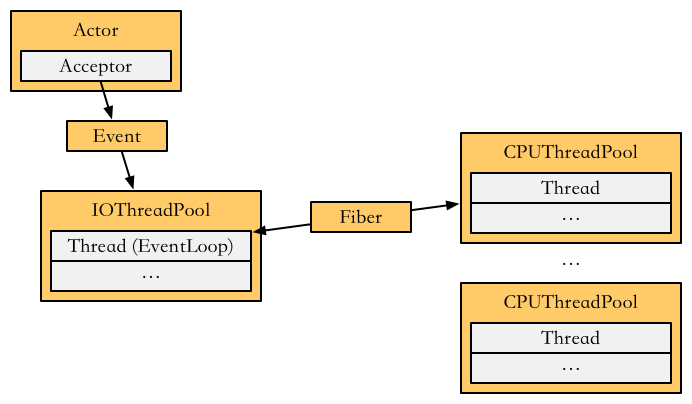
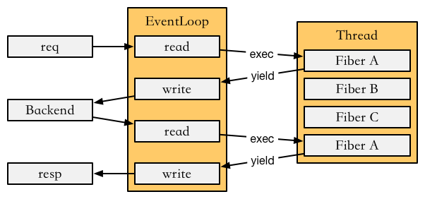
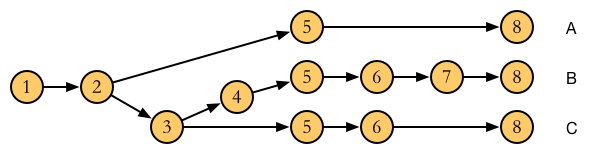
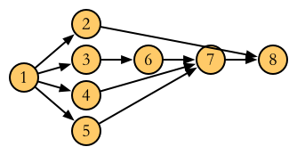

.. _design:

架构设计
========

分层架构
--------

raster框架采用了分层设计和模块化的处理，可以分成基础库、事件、并发、IO、网络、协议、调度、插件等几个部分，整体上又可以分为三层来理解：

- 底层是核心组件和框架，包括基础库、事件、IO、并发等。
- 中间层在底层基础上，实现了多种网络协议的支持，向上提供RPC，同时包含了调度机制。
- 上层和应用相关，包括并行计算、日志、监控统计、多种插件。

    raster的分层架构

为了能够支持多种协议，并且易于扩展，raster的网络模型也做了清晰的分层。由下至上，可以分为网络层、传输层、解析层、路由层、处理层。

- 网络层：即使用socket套接字编程，支持TCP协议。
- 传输层：在网络层之上，需要对传输的数据进行组织，以一定的协议约定进行处理。这主要是数据头部的部分。以thrift为例， ``TFramed`` 即为传输协议的一种，它以一个32位整数表示后续的数据长度。可以自定义传输协议。
- 解析层：或者称为序列化和反序列化层，按照一定的序列化协议对数据做二进制字符串到结构化数据的转换。如thrift和protobuf。
- 路由层：序列化/反序列化的数据由哪种接口处理，是路由层的工作，对于RPC来说，就是具体的RPC通信方案，如thrift。对于无路由的情况，此层为空。
- 处理层：对应到具体的接口后，需要以特定的接口实现来处理，处理层管理这些钩子，在执行到处理的步骤时，进行调用。

    raster的网络模型

网络调度
--------

目前主流方案是采用 ``epoll`` 来做事件处理。和传统的IO多路复用 ``select`` 等相比， ``epoll`` 是内核实现的，并且采用红黑树管理事件，调度效率高很多，可以满足大量并发事件处理的需求。

raster框架也采用了 ``epoll`` ，但是和很多其他的框架不同，没有使用libevent/libev等对 ``epoll`` 做封装的第三方库，而是自己封装了 ``epoll`` 。这么做的原因是可以减少依赖，同时有优化调整的便利性。

raster采用多线程模型，有两种线程池实现，分别是 ``IOThreadPool`` 和 ``CPUThreadPool`` ，它们从共同的 ``ThreadPool`` 基类继承而来，都支持添加任务的接口。

- ``IOThreadPool`` ：每个线程中包含一个 ``EventLoop`` ，即一个 ``epoll`` 的处理器。添加任务时，添加到通知队列， ``epoll`` 循环可以收到通知，处理任务。额外还可以添加IO事件回调。
- ``CPUThreadPool`` ：和 ``IOThreadPool`` 相比，它简单一些，添加任务时，添加到阻塞队列，以信号的形式通知线程，空闲线程执行任务。

调度模型
~~~~~~~~

下图是详细的raster的调度模型：

    raster的调度模型（每个服务使用独立的 ``CPUThreadPool`` 的情况）

进程的主线程包含 ``Actor`` ， ``Actor`` 的 ``Acceptor`` 可以监听端口，接收请求。接收到的请求封装为 ``Event`` ，添加到 ``IOThreadPool`` 中，在这里完成网络的异步读写，然后再包装为 ``Fiber`` ，添加到各服务 ``Channel`` 对应的 ``CPUThreadPool`` 中，调度执行。

具体实现时，可以通过配置，让所有服务关联到同一 ``CPUThreadPool`` ，甚至不使用 ``CPUThreadPool`` ，全部使用 ``IOThreadPool`` 。可以根据实际场景需要做选择。

协程
~~~~

raster通过协程实现了同步编程模式，避免了回调陷阱。当请求经 ``EventLoop`` 处理之后，包装为 ``Fiber`` 。每个 ``Fiber`` 有 ``Context`` 变量，目前采用的是Boost的版本，也可以使用Linux自带的 ``ucontext`` 。 ``Context`` 可以注册一个函数，同时 ``Context`` 可以切换为执行或者挂起，再次执行时，从挂起位置继续执行。这样，将 ``Fiber`` 添加到线程之后，执行它，即可执行函数，挂起即可暂时将 ``Fiber`` 从该线程移出，之后可以再次添加继续执行。

下图示例了一个请求的全过程。 ``req`` 到来之后，由 ``EventLoop`` 完成读取，以 ``Fiber`` 形式添加到线程执行，执行中，该 ``Fiber`` 的注册函数需要访问后端服务。 ``Fiber`` 执行 ``yield`` 切出线程，重新添加到 ``EventLoop`` ，完成后端请求的写和读。之后使用原来的 ``Fiber`` ，添加到线程继续执行。执行完毕后，再回到 ``EventLoop`` ，返回 ``resp`` 。注意在 ``Fiber`` 进入线程的两次之间，线程可以执行其他的 ``Fiber`` 。通过这种调度方式，线程不必阻塞，事件回调也可以等待，从而以同步方式做到了异步非阻塞的效果。

    一次请求经过的协程调度

协程本质上是用户态的计算资源调度，可以视作轻量级的线程，但线程是内核负责调度的。协程相比线程高效，主要依赖于它的栈大小比较小，切换的开销很小，根据实际的情况，协程栈大小一般在16KB-64KB之间。

并发请求后端
~~~~~~~~~~~~

在服务中，有时需要去访问后端，而且对于多数据来源的情况，可能需要请求多个后端，如果这些后端的访问之间没有先后依赖关系，那么将它们并发处理，可以节省不少耗时的开销。

在前面介绍的调度方式的基础上，很容易实现并发请求后端的需求。

具体的方式是在 ``Fiber`` 中执行请求多个后端时，将这些请求关联到同一个分组，在请求返回时，检查对应分组，未全部返回时，不做操作；全部返回后，才重新调度 ``Fiber`` ，并释放该分组。

高并发
~~~~~~

高并发主要指两个方面：

- qps高：服务可以在同样资源同样时间的情况下，处理更多的请求。服务qps的瓶颈一般来自阻塞，阻塞导致线程利用率不高，阻塞的来源一般是网络请求（特别是后端请求）等待。因此，通过异步非阻塞可以提高服务的qps。当然，其他导致请求阻塞的地方也要处理，比如使用异步日志。
- 连接数高：对于一些长会话类的服务，比如通讯、游戏领域的服务，往往需要维护大量的网络连接，在大量连接时，保持性能很重要。和 ``select`` 相比，采用 ``epoll`` 可以提高大量连接时的事件处理效率。

raster框架基于 ``epoll`` ，实现异步非阻塞，并且用协程的方式简化了编程。做到了高并发，同时仍保证了简单易用。

策略调度
--------

在应用层面，raster框架还有对策略调度的支持。每个请求处理时，实现了具体的业务策略，对于复杂的请求，一般会把策略做划分，拆分成多个子任务。这些子任务的调度方案称为策略调度。

策略调度需要考虑三个问题：

- 如何去掉某些任务的执行：有时候线上服务压力大，我们需要不执行某些对效果影响不大的耗时任务，这称为降级。
- 如何动态选择某一条任务执行路径：新上线了某些策略，需要对新老策略的效果做对比，这是ABTest。
- 如何并行执行一些任务：并行处理一些无依赖关系的任务，可以降低单个请求的耗时。

下图示范了这些问题的一个对应场景：

    策略调度的三种场景

和B相比，A和C可以看做是降级；ABC之间相互可以理解为ABTest。

策略调度可以看作是对多个路径的方案的选择和执行。可以采用配置化、动态关联等来解决前两个问题。下面解释一下并行调度的实现。

并行计算
~~~~~~~~

上面的B在可以并行调度时，可以有下图的依赖关系：

    并行的策略调度

此即为并行调度执行要解决的问题。调度这一路径，可以采用DAG的方案来管理任务，每个任务有它的前向依赖和后续任务。

执行时，从根任务开始执行；执行完毕后，调度它的后续任务，对于每个后续任务，检查它的前向依赖，如果所有前向依赖已经执行完毕，那么即可执行它；执行完毕后，再继续执行后续任务，直到最后。

在raster框架中，任务以 ``Fiber`` 的形式调度执行。 ``Fiber`` 的注册函数抽象为 ``Executor`` 。这样网络调度和策略调度，可以采用同一套底层的任务调度机制，只是具体表现有区别，采用不同的 ``Executor`` 的派生类。

分布式和高可用
--------------

最后在聊一点服务集群化方面的内容，主要是分布式和服务高可用，raster框架本身关注在基础库和RPC领域，分布式和高可用需要通过其他手段来解决。这里只做简单介绍。

分布式
~~~~~~

大规模的后端服务往往不是一台单机可以负载全部请求的。因此需要通过分布式这样的手段来将请求分配到不同的机器上。

分布式针对不同的场景有以下常见几种：

- 服务的分布式：常见于在线服务，将大量请求分配到多台机器上，一般采用轮询（Round Robin）的方式将请求从前端服务分配到后端。辅以负载均衡策略来保障后端公平。分布式消息队列也可以归于此类。
- 数据的分布式：对于数据库、缓存、索引等数据相关的服务，数据无法单台承载时，即需要考虑数据的拆分。数据拆分分为水平拆分，即按照业务拆分，垂直拆分，一般为根据某个域拆分。数据做分布式拆分后，可能需要用一致性哈希的方式组织。
- 计算的分布式：计算的分布式更为复杂，计算任务在多台机器上调度执行，上面的并行计算扩展到多台机器上即为分布式计算。它常用在离线，目前在往实时方向发展。计算分布式的复杂在于它的任务分成多个子任务，存在前后依赖关系，这时涉及两个问题：一个是子任务间的同步，以保障时间线正确；另一个是子任务失败会影响整个任务调度。这个领域的框架种类很多。

分布式需要重点解决的一个问题是一致性，即多个节点的数据或者状态的一致性，这方面有Paxos协议、Raft协议等。

对于服务分布式，这也是最常见的一种分布式，可以通过服务治理来实现。服务治理使用命名服务器，在IP的基础上，对机器分组，指定特定的key，代表某个服务的某组机器。请求后端服务时，通过命名服务器，根据key取得提供服务的某台机器的IP，然后发起请求。这样做的好处主要有三点：

- 统一在服务治理来实现，避免了机器管理的混乱和全局不可见。
- 可以在服务治理做负载均衡方案，并且避免了重复实现。
- 机器管理方便，易于操作上下线、屏蔽等。

服务高可用
~~~~~~~~~~

配合前面提到的服务治理，就可以在服务高可用方面做得更加完善。

服务的高可用需要考虑：

- 服务过载如何处理
- 服务节点失效如何处理
- 服务节点性能不均如何处理

服务过载即单机流量过大，无法承载。这里不考虑加机器等方案，只考虑瞬时的流量大涨，这时一般采用降级和限流两个办法处理。降级即通过关掉某些策略，降低耗时，提高qps负载能力。限流是丢掉无法处理的更多的请求。通过这两个办法，基本可以确保服务在过载时，不会无法服务，但这两个方案是有损的。无损的方案除了增加机器，还有使用缓存的办法，缓存的方案比较多，根据实际情况实现也有不同，一般也是不针对瞬时高流量的，但可以有一些缓解。

节点失效的原因比较多，比如服务挂了，网络无法连通了，机器宕机了等等。节点失效问题，配合服务治理之后，就比较容易解决了。

- 服务治理在每台机器会有agent来监测服务状态，服务挂了时，主动通知server，然后推送到所有agent，前端服务在取后端节点时，不再选择该节点。
- 网络无法连通和机器宕机时，该机器的agent也已经失效，这时通过server监测，由于网络不稳定可能出现误判，因此有一定的重试判断。

节点的响应时间由于机器本身的区别，可能有一定的差距，表现为节点的性能不均。这可以通过加权的负载均衡来解决。加权负载均衡由服务治理实现。主要权重为响应时间，这样就对后端节点的选择采用了不等的概率。

